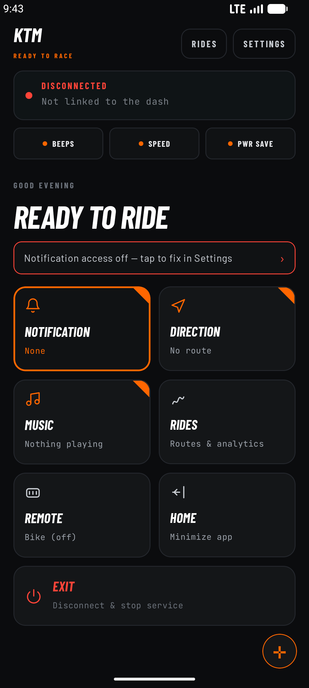
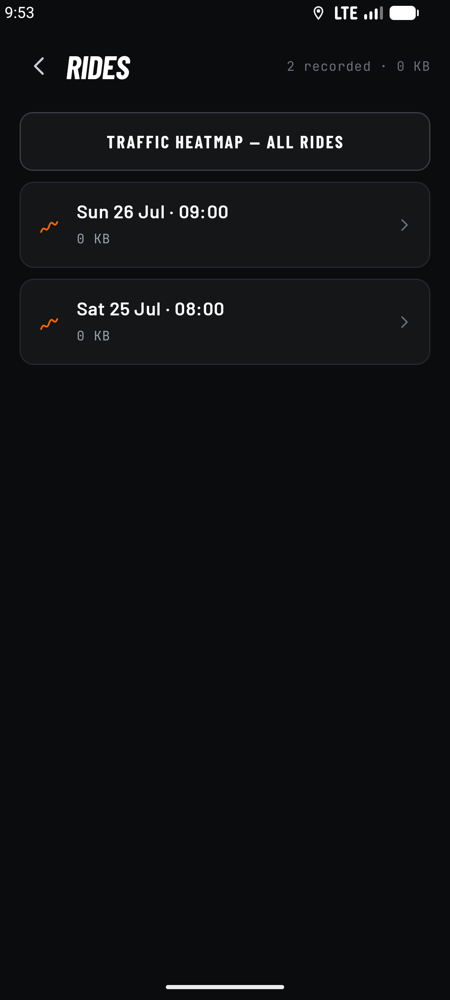
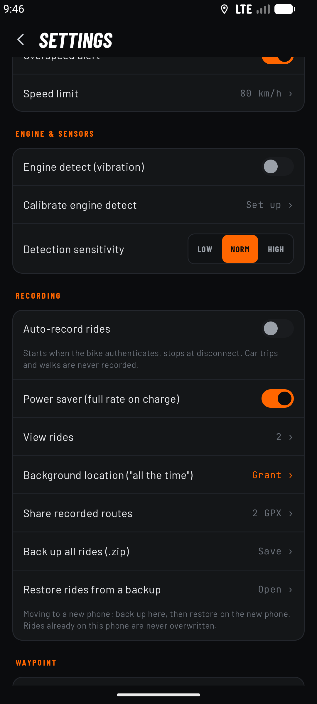
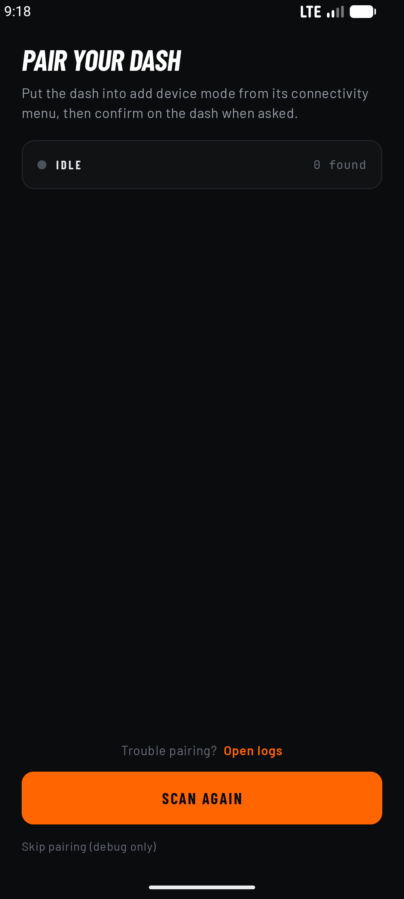
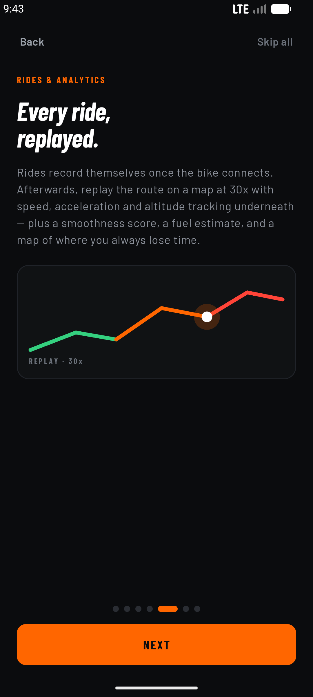

<p align="center">
  
</p>

<h1 align="center">Navigator Gen3</h1>

<p align="center">
  <b>Turn-by-turn navigation, notifications and ride analytics on your KTM or Husqvarna Gen-3 dashboard — free, private by default, on-device (with an optional in-app Google navigation mode).</b>
</p>

<p align="center">
  <i>An independent, open-source companion app. Not affiliated with, or endorsed by, KTM or Husqvarna.</i>
</p>

<p align="center">
  <a href="../../releases/latest"><b>Download the latest APK</b></a>
</p>

---

## What it does

Three jobs, all on your phone, with no account and no server of ours.

| | |
|---|---|
| **Push to the dash** | Turn-by-turn navigation (mirror another nav app, or enter a destination and navigate in-app with Google), phone notifications, now-playing and idle info, on the bike's own display over Bluetooth. |
| **Pull from the handlebar** | The bike's four handlebar buttons become a controller for your phone — a D-pad over any app, or music transport. |
| **Record and analyse the ride** | Rides record themselves as standard GPX, then come back as a map, charts, detected events, a smoothness score and a fuel estimate. |

---

## What works today

**Silent auto-reconnect.** Once paired, cycling the ignition off and on reconnects on its own in about a
second — no accepting an "add device" prompt on the dash every ride. The app remembers your pairing keys
and re-presents them, and keeps them across app updates, reinstalls and new phones. Verified on a KTM 390
Adventure across repeated ignition cycles.

**Google Maps turn-by-turn, on your bike's dash.** Start navigating and the Gen-3 centre display shows
the turn arrow, distance, road name, ETA and remaining distance. The maneuver arrow — including
roundabout exits, U-turns, keep/fork and ramps — is recognised by a small on-device neural network
trained on Google Maps' own icons, because Maps puts no maneuver *text* in its notification.

**Automatic bike detection.** On connect it reads the dash's model, firmware and capabilities and shows
what it found in the connection banner. Nothing to configure.

**KTM and Husqvarna.** They share the same dash electronics, and the whole app re-themes to match your
bike — KTM dark and orange, Husqvarna light and blue. You pick on first run and can switch any time.

| Brand select (KTM) | Brand select (Husqvarna) |
|---|---|
|  |  |

**Handlebar remote — a real controller.** Long-press **Up** from any screen opens a mode picker:

| Mode | Up | Down | Set | Back |
|---|---|---|---|---|
| **Controller** | move up | move down | tap = right · double-tap = **open/select** · hold = long-press | tap = left · double-tap = back |
| **Music** | tap = volume up · double-tap = next track | tap = volume down · double-tap = previous | play / pause | — |
| **Bike (off)** | — | — | — | the buttons go back to the bike |

Long-press **Down** opens Google Maps from anywhere. Every press is read on release, and the app tells a
tap, a double-click and a press-and-hold apart using thresholds measured on the real hardware.

**Turn sounds.** Optional stereo approach beeps — left ear for a left turn, right for a right — that
speed up as you near the corner and go quiet when you stop. Adjustable volume, swappable channels.

**Overspeed alert.** Plays on the alarm channel at full volume, so it's audible over wind and engine and
sounds through Do Not Disturb.

**The dash's idle screen.** When you're not navigating, the dash rotates clock and date, the current
track, and live weather (via Open-Meteo, no API key). When the next turn is 500 m+ away it can show the
song instead of the road name, switching back as the turn approaches.

**Notification mirroring** with group chats and summary notifications filtered out so only real messages
get through, emoji and unsupported glyphs stripped so text reads cleanly, and a one-tap quick-mute.

**Ride recording and analytics.** Rides save as standard GPX and come back as a real map coloured by
speed with traffic stretches highlighted, a master time slider that scrubs the map marker and every chart
together, harsh-acceleration / hard-braking / rough-road detection rolled into a 0–100 smoothness score,
a fuel-cost estimate, and a traffic map that aggregates every ride into a picture of where you routinely
lose time.

**Diagnostics that earn their keep:** symbol testing and turn-icon calibration to match glyphs to your
exact dash, a per-slot dash text playground, and shareable logs — which is how bug reports get made.

| Ride tools and sounds | Engine-vibration calibration |
|---|---|
|  |  |

---

## Coming in the next build

Built and running, **not yet in the download above**. Field-testing on a bike is what stands between
these and a release.

**Ride replay.** Press play and the ride runs itself at 30×: a heading-oriented marker glides along the
route with the camera following, the trail behind it at full strength and the road ahead dimmed, and
every chart cursor advancing in step. The charts gained smooth curves, pinch-to-zoom into a shared time
window, and tappable peak/dip values.

**Crawl vs signal traffic.** Traffic is now two distinct things, using engine state recorded per GPS
point: creeping with the engine on is a crawl, fully stopped with the engine on is a signal, and engine
off is never traffic — so a coffee stop stops being counted as a jam.

**A traffic prediction mode** built only from your own rides: a frequency model over location ×
weekday/weekend × time-of-day that needs at least four passes through the same spot before it will say
anything, and always shows the sample count.

**In-app music screen** laid out one-to-one with the handlebar remote, so the screen teaches the buttons.

**Ride backup and restore.** Back up every ride and its sensor data to a single `.zip`, and restore it on
a new phone — rides already on the phone are skipped, never overwritten. Switching phones no longer means
losing your history or the traffic map built from it.

**Auto-exit.** The app closes itself after 10 minutes with no bike connected, so it doesn't sit running in
your pocket on a day you never rode. The timer resets on connect and is suspended while a ride is
recording.

**A rebuilt interface** across every screen: glove-sized targets, a focus ring on everything the handlebar
remote can reach, and Settings split into eight labelled groups.

| Home | Rides | Recording & backup |
|---|---|---|
|  |  |  |

| Pairing | Onboarding |
|---|---|
|  |  |

---

## Privacy — private by default; one clearly-marked online mode

- No accounts of ours. No analytics. No data collection. No ads. No server of ours.
- **By default everything runs on-device**: the turn-icon model, notification handling, ride recording
  and analytics. When you **mirror another nav app** (e.g. Google Maps) to the dash, the app only reads
  that app's on-screen notification and forwards the text over Bluetooth — nothing leaves the phone.
- **Optional in-app Google navigation** *does* go online. If you enable it (needs your own Google Maps
  Platform API key + Google Play Services) and enter a destination in the app, Google's Navigation SDK
  runs the route — which means your **destination and location are sent to Google**, and it needs
  internet. This is off unless you provide a key, and can be turned off any time in
  **Settings → Navigation → In-app Google navigation** (leaving you on the offline mirroring mode). While
  it's navigating you'll also see Google's own notification alongside the app's.
- Other optional, opt-in online bits: live weather for the dash idle screen (Open-Meteo, no key, coarse
  location only), and notification summaries if you add your own Gemini API key — both off by default.

---

## Compatibility and setup

- Tested on a **KTM 390 Adventure (2025)**. It targets the Gen-3 "connected" dash that KTM's and
  Husqvarna's own apps use for turn-by-turn, so it should work on other 2020+ Gen-3 bikes — but 1290 /
  890 / SMC and the Husqvarna models are still lightly tested. Reports and logs are very welcome.
- You likely need the connectivity / Tech Pack active. The turn-by-turn dash feature appears to be gated
  behind that activation; without it the dash may not expose the nav feature to pair with. Not fully
  confirmed — testers with and without it, please report.
- **Pairing tips** if the bike doesn't show up: put the dash into "add device" mode from its own
  connectivity menu first, make sure Bluetooth is on, and note that the app also lists devices already
  bonded to your phone. The first pairing needs the physical "add device" confirmation on the dash.
- **Android 16:** sideloaded apps have notification access blocked until you enable "Allow restricted
  settings" (App info → three-dot menu) before granting it.

## Known issues

1. First pairing needs the physical "add device" confirmation on the dash. Expected, once per bike. (The
   very first reconnect after installing asks once more — that's when the keys are captured — then every
   ride after that is silent.)
2. Turn-icon accuracy depends on your Google Maps version and your specific dash. If an icon looks wrong,
   correct it with the Symbol Test and Turn-icon Calibration screens.
3. Husqvarna support has never been verified on a physical Husqvarna. It runs on the same dash protocol
   and should work, but all testing so far has been on a KTM.
4. Engine detection uses the phone's motion sensor, needs a short calibration, and varies by phone and
   mount. Without it, traffic detection falls back to a time-based guess.
5. Rough-road detection needs a ride recorded on v0.3.0 or later — older GPX files fall back to GPS-only
   event detection.
6. The full analytics map needs a free Google Maps API key added at build time (below). Without one,
   everything still works via the built-in route sketch.
7. Full vehicle telemetry (RPM, gear, coolant, fuel, TPMS) exists in the protocol but the dash rejects
   the writes. It is **not** available — help welcome.
8. This is a beta. If something crashes or misbehaves, please open an issue or share your logs from
   Settings → Diagnostics, and include your bike model and firmware if you can.

---

## Install (no build needed)

Grab the APK from the [latest release](../../releases/latest), copy it to your phone and open it (you'll
need to allow "install from unknown sources"). First-ever pairing needs the physical "add device"
confirmation on the bike's dash.

## Build it yourself

Prerequisites: Android Studio (latest) or the command-line Android SDK; JDK 17 (bundled with Android
Studio); Android SDK Platform 34 and build-tools.

```bash
git clone <this-repo>
cd <this-repo>

# point Gradle at your SDK (either export this or create local.properties)
echo "sdk.dir=$HOME/Library/Android/sdk" > local.properties   # macOS
# echo "sdk.dir=$HOME/Android/Sdk"        > local.properties   # Linux

./gradlew :app:assembleDebug
# -> app/build/outputs/apk/debug/app-debug.apk
```

Install to a connected phone with `adb install -r app/build/outputs/apk/debug/app-debug.apk`.

**Optional — the full analytics map.** Get a free key at console.cloud.google.com, enable "Maps SDK for
Android", restrict it to package `com.navigator.app` plus your keystore's SHA-1, then add
`MAPS_API_KEY=your-key` to `local.properties` before building.

On the phone: enable **Notification access** (required to mirror navigation and notifications); enable
**Accessibility** only if you want the handlebar remote to control other apps; and disable battery
optimisation so the app stays connected in the background.

## The turn-icon model (`ml/`)

The classifier is trained from scratch on Google Maps' own publicly shipped, self-labeled maneuver icons
— no proprietary weights. `ml/train_maneuver_model.py` reproduces
`app/src/main/res/raw/maneuver_model.tflite` locally or on free Google Colab. The labeled dataset is
generated on-device by a debug exporter (see [`ml/README.md`](ml/README.md)).

## Contributing — help wanted

This is an early, community-driven hobby project and contributions are very welcome, whether you ride one
of these bikes or just enjoy reverse-engineering and Android/BLE work. Good places to start:

- **Full vehicle telemetry** over the dash's PRPC channel — the service is present but the writes are
  rejected.
- **Older "MY RIDE" bikes** need a second connection path (Bluetooth Classic + JSON).
- **Test on a physical Husqvarna** and report how it goes.
- More nav apps (Waze, OsmAnd, HERE) and notification sources.
- Improve the turn-icon model with real captured icons.
- Testing on other Gen-3 bikes and firmware, and reporting what works.
- UI polish, docs, translations.

Open an [issue](../../issues) with logs and details, or send a pull request. Please keep the project's
core promise intact: **on-device only, no data collection.**

## Disclaimer

Unofficial hobby project for Gen-3 KTM and Husqvarna dashes, provided as-is with no warranty. Not
affiliated with KTM or Husqvarna. Ride responsibly — do not interact with your phone while riding.

## License

[MIT](LICENSE)
